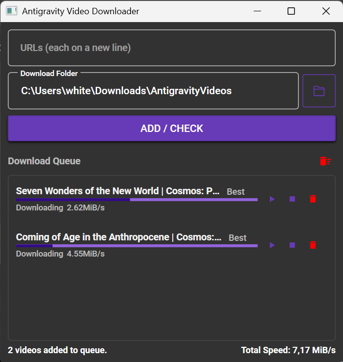

# Antigravity Video Downloader

A lightweight, modern Windows desktop application to fetch and download videos from YouTube and other platforms.

## Features & Usage
- **Multi-URL Fetching**: Paste multiple URLs and fetch their available resolutions.
- **Easy Downloading**: Powered by `yt-dlp` and `FFmpeg` to download videos directly to your selected folder.
- **Queue Management**: Add to the queue, Play, Stop, Remove or Clear All easily.
- **Auto Config Storage**: Automatically saves your selected download path incrementally.

Developed with C#, .NET 10.0 WPF, MVVM, and MaterialDesignThemes.
